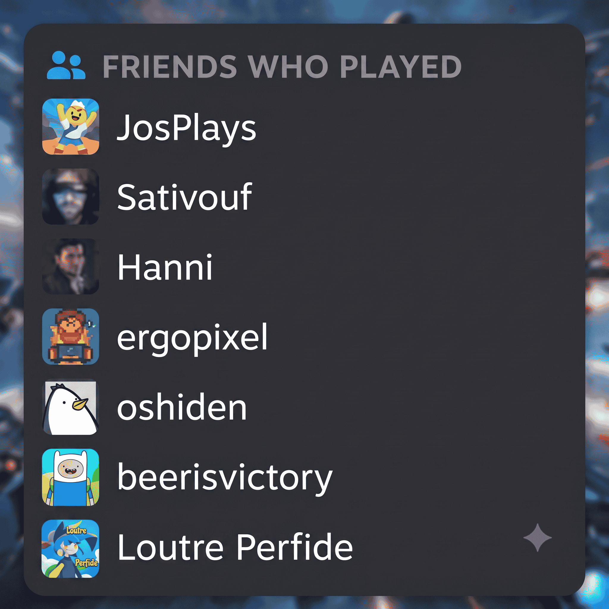

# Friends Activity Bubble

A Decky Loader plugin that shows a floating "Friends who played" bubble over the hero art on a game's details page (Clean GameView compatible), with adjustable position/offset like `steam-achievements`.



## How it works (confirmed on real hardware)

1. `window.SteamClient.Apps.GetFriendsWhoPlay(appid)` → returns an array of SteamID64s (the same friends shown by the native "Friends who played this game" widget under the Activity tab).
2. Each SteamID64 is converted to its 32-bit accountid (`BigInt(id64) & 0xFFFFFFFFn`).
3. `window.friendStore.allFriends` (already loaded by the Steam client for your real friends list — no extra network call needed) is used to look up `display_name` and `persona.avatar_url` for each accountid.
4. The route patch injects the bubble into the same `InnerContainer` as `steam-achievements`, with the same scroll-to-hide behavior (so it doesn't duplicate the native widget if you're not using Clean GameView and the Activity tab is visible further down the page).

## Friends with private playtime

`GetFriendsWhoPlay` skips friends who hide their playtime. For the remaining friends the plugin calls `SteamClient.Apps.GetFriendAchievementsForApp(appid, id64)`, which goes through your logged-in Steam client (so friends-only data is visible, no API key needed), and adds those with at least one unlocked achievement to the bubble. Results are cached for 30 minutes.

## Known limitations

- `GetFriendsWhoPlay` and `friendStore` are undocumented internal APIs — they could change in a future SteamOS update, same as `GetMyAchievementsForApp` for `steam-achievements`.
- If a friend isn't present in `friendStore.allFriends` (rare, e.g. not yet loaded into memory), their name falls back to a generic "Friend".

## Installation

**From a release:** download the `SteamOS_Friends_activity` zip from the [Releases](../../releases) page and install via Decky Loader → **Developer** → **Install Plugin from ZIP file** (uninstall the previous version first if you're updating).

**From source:**
```bash
npm install
npm run build
```
This produces `dist/index.js`. Zip up the plugin folder (`dist/`, `main.py`, `package.json`, `plugin.json`, `README.md`) and install it the same way.

## Settings (Quick Access Menu `...` → Friends Activity Bubble)

- Bubble position (top-left / top-right / top-center / bottom-left / bottom-right / bottom-center)
- Horizontal / vertical offset
- Max number of friends shown

## Project structure

```
.
├── src/
│   └── index.tsx  # plugin source (TypeScript + @decky/api + @decky/ui)
├── dist/          # build output (git-ignored, generated by `npm run build`)
├── main.py        # no-op, just here for Decky's expected plugin structure
├── rollup.config.mjs
├── tsconfig.json
├── plugin.json
└── package.json
```
